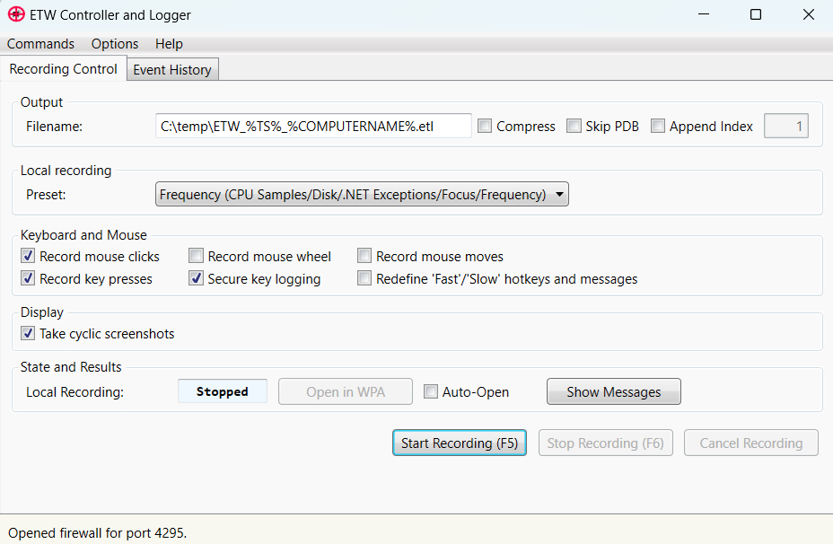

# What is it?

ETWController is the tool to troubleshoot Windows performance issues. It can profile

* Your local machine
* A remote machine
* Both machines simultaneously

What it makes it unique is that it captures all user input (configurable) along with screenshots. That makes it easy to spot the hang or exception from the screenshots. No more guessing what the user is telling you what he did. Now you can see it. And the best thing is that each screenshot/keyboard press gets its own ETW event which makes it trivial to navigate in 
the profiling data to the right time point where much more insights are waiting for you. 



## Predefined Recording Presets
With the latest release is comes with an annotated predefined wpr recording profile called MultiProfile.wprp which shows most features present in ETW.
The recorded data can be analyzed with [ETWAnalyzer](https://github.com/Siemens-Healthineers/ETWAnalyzer) in much greater detail. 

- **Full (Network+CSwitch+File+Frequency)**
  -  The catch all profile if you need to track the complete system which captures most data but can record only about 1-2 minutes on a busy machine.
- **Default (CPU Samples/Disk/.NET Exceptions/Focus)**
  -  This will capture no context switch data which spares a lot of space and is still very detailed.
- **Frequency (CPU Samples/Disk/.NET Exceptions/Focus/Frequency)**
   - Same as Default but captures also CPU frequency data. 
- **File (CPU Samples/Disk/.NET Exceptions/Focus/File IO)**
  -  Same as Default but additionally it captures all File accesses. Low additional overhead.
- **Network (CPU Samples/Disk/.NET Exceptions/Focus/Network)**
  -  Same as Default but also records every network packet source and destination IP. No packet data is captured.
- **VirtualAlloc (Long Term)**
  - If you have big memory leaks this might be a first step to find in longer recording (up to 20 minutes) what went wrong. 
- **UserGDILeaks (Long Term)**
  - Since Windows 10 1909 GDI/User object creation destruction is also instrumented with ETW. Best Viewed with WPA.
- **PMCSample (PMC Sampling for PMC Rollover + Default)**
  - Capture CPU counters in sampling mode. Similar what VTune does.
- **PMCBranch (PMC Cycles per Instruction and Branch data - Counting)**
 - Capture CPU counters in sampling mode. Similar what VTune does.
- **PMCLLC (PMC Cycles per Instruction and LLC data - Counting)**
 - Capture CPU counters in sampling mode. Similar what VTune does.
- **LBR (LBR - Last Branch Record Sampling)**
 - Capture CPU counters in sampling mode. Similar what VTune does.
- **SysCall (CPU Samples/Disk/.NET Exceptions/Focus/SysCall)**
  - Same as Default but records all Kernel calls from user mode processes with stack traces. Useful for security researchers.
    Unlike strace on Linux only the return code of the API call is recorded and no method arguments are collected.
- **WPR Default**
 - WPR Default profile provided by MS. 
- **WPR Default + .NET**
  - WPR Default profile with .NET provider.

All profiles except the WPR profiles can be combined. To change a profile select first a profile and then select ```<Manual Editing>``` to show the ```Start Command``` line.
You can then add additional or other profile settings. The predefined settings are stored in ETWController.exe.config.

You can change the CPU sampling rate by adding to the xxwpr command line ```-setprofint 100000``` to e.g. set a 10ms sample interval. WPR does support this command line switch 
but it does not work when you try to start a profile with a custom sample rate. The xxwpr script works around that limitation and calls wpr -setprofint with your custom CPU sample 
interval after the profile has been started.

## XCopy Deployable on Windows 10

### Recording Data
To record the data it needs wpr.exe which is already part of Windows 10. On Windows 7 you need to install the Windows Performance Toolkit which is part of the Windows 8.1 SDK (https://go.microsoft.com/fwlink/p/?LinkId=323507).

### Analyzing Data
To view the data it is best to install the latest Windows Performance Toolkit from the Windows 10 SDK (https://developer.microsoft.com/en-us/windows/downloads/sdk-archive).

 
